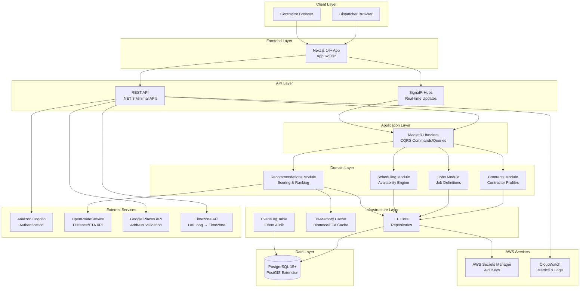

# SmartScheduler Fullstack Architecture Document

## Introduction

This document outlines the complete fullstack architecture for SmartScheduler, including backend systems, frontend implementation, and their integration. It serves as the single source of truth for AI-driven development, ensuring consistency across the entire technology stack.

This unified approach combines what would traditionally be separate backend and frontend architecture documents, streamlining the development process for modern fullstack applications where these concerns are increasingly intertwined.

### Starter Template or Existing Project

**N/A - Greenfield project**

This is a new project starting from scratch. No existing codebase or starter templates are being used. The architecture will be built following the PRD specifications for a Modular Monolith with DDD + CQRS patterns.

### Change Log

| Date | Version | Description | Author |
|------|---------|-------------|--------|
| 2025-01-XX | 1.0 | Initial architecture document created | Winston (Architect) |
| 2025-01-XX | 1.1 | Simplified MVP: Replaced Redis with in-memory caching, simplified Outbox to EventLog with in-process publishing | Winston (Architect) |
| 2025-11-12 | 1.2 | Added NSwag for TypeScript API client generation with interface-based models | Winston (Architect) |
| 2025-11-12 | 1.3 | Added missing APIs for v0 frontend: Settings, Activity Feed, Dashboard Stats, and enhanced Contractor/Job models | Winston (Architect) |
| 2025-11-12 | 1.4 | Added Google Places Autocomplete for address validation, timezone tracking for job locations, and dashboard statistics implementation | Winston (Architect) |

## High Level Architecture

### Technical Summary

SmartScheduler is built as a **Modular Monolith** using Domain-Driven Design (DDD) and CQRS patterns, deployed as a single .NET 8 application with strict internal boundaries. The frontend is a separate Next.js 14+ application using the App Router. The architecture separates concerns into **Domain**, **Application**, **Infrastructure**, and **API** layers, with a React/Next.js UI consuming REST APIs and SignalR hubs for real-time updates. The system integrates with AWS services (Cognito for authentication, PostgreSQL for persistence) and OpenRouteService for distance/ETA calculations. For MVP, the system uses in-memory caching and in-process event publishing to reduce deployment complexity. This architecture achieves PRD goals by enabling rapid development of the MVP while maintaining clear boundaries for future scaling, supporting the 500ms p95 latency requirement through in-memory caching and optimized distance calculation strategies, and providing real-time updates via SignalR for dispatcher and contractor workflows.

### Platform and Infrastructure Choice

**Platform:** AWS (Amazon Web Services)

**Key Services:**
- **Compute:** Elastic Beanstalk for .NET 8 application hosting (simplifies deployment with built-in auto-scaling, load balancing, and health monitoring)
- **Database:** RDS PostgreSQL 15+ with PostGIS extension for geospatial queries
- **Caching:** In-memory caching (IMemoryCache) for MVP - Redis can be added post-MVP if needed
- **Authentication:** Amazon Cognito (User Pool + Hosted UI) for OIDC/OAuth2
- **Storage:** S3 for static assets and file storage (if needed)
- **Monitoring:** CloudWatch for metrics and logs, X-Ray for distributed tracing
- **Secrets:** AWS Secrets Manager for API keys (OpenRouteService, Google Places API) and database credentials
- **Configuration:** SSM Parameter Store or AppConfig for versioned weights/config (post-MVP)

**Deployment Host and Regions:** 
- Primary region: us-east-1 (or user-specified)
- Single region deployment for MVP (multi-region is post-MVP per PRD)

**Rationale:**
- PRD explicitly specifies AWS as the cloud platform
- Elastic Beanstalk provides simplified deployment for .NET 8 applications with minimal infrastructure management overhead, ideal for MVP rapid development
- Elastic Beanstalk includes built-in auto-scaling, load balancing, health monitoring, and rolling deployments, reducing operational complexity
- SignalR WebSocket support requires session affinity (sticky sessions) on load balancer, which Elastic Beanstalk supports via Application Load Balancer configuration
- Cognito provides managed authentication with minimal setup overhead for MVP
- RDS PostgreSQL with PostGIS supports geospatial queries required for distance calculations
- In-memory caching (IMemoryCache) reduces deployment complexity for MVP while still enabling sub-500ms responses
- Redis can be added post-MVP if multi-instance deployment or persistent cache is needed
- AWS ecosystem integration simplifies deployment and operations
- Cost-effective for MVP scale while providing clear scaling path (Elastic Beanstalk uses underlying EC2 instances, no additional service fee)

### Repository Structure

**Structure:** Monorepo (single repository for backend and frontend)

**Monorepo Tool:** N/A - Simple folder structure (no additional tooling for MVP)

**Package Organization:**
```
smart-scheduler/
├── src/              # Backend (.NET 8)
│   ├── Api/
│   ├── Application/
│   ├── Domain/
│   ├── Infrastructure/
│   └── Realtime/     # SignalR hubs
├── ui/
│   └── web/          # Next.js 14+ frontend
└── docs/              # Documentation (PRD, Architecture, etc.)
```

**Rationale:**
- PRD specifies this folder layout in section "Folder Layout (repo)"
- Simple structure sufficient for MVP (no need for complex monorepo tooling)
- Clear separation between backend (`src/`) and frontend (`ui/web/`)
- Shared code can be added later if needed (e.g., TypeScript types for API contracts)

### High Level Architecture Diagram



### Architectural Patterns

- **Modular Monolith:** Single deployable application with strict internal module boundaries - _Rationale:_ Enables rapid MVP development while maintaining clear separation for future microservices extraction if needed. PRD explicitly specifies this pattern.

- **Domain-Driven Design (DDD):** Domain entities, value objects, aggregates, and domain events - _Rationale:_ Ensures business logic is properly encapsulated in domain models, making the system more maintainable and aligned with business requirements. PRD specifies DDD as core architecture principle.

- **CQRS (Command Query Responsibility Segregation):** Separate command and query handlers using MediatR - _Rationale:_ Enables optimized read/write paths, supports event sourcing patterns for audit trails, and simplifies complex business logic. PRD specifies CQRS as part of the architecture.

- **Clean Architecture Layers:** Domain, Application, Infrastructure, API layers with dependency inversion - _Rationale:_ Ensures business logic is independent of infrastructure concerns, enabling testability and future technology swaps. PRD specifies Clean Architecture layers.

- **Event-Driven Architecture:** Domain events published in-process with SignalR - _Rationale:_ Enables real-time UI updates via SignalR, supports future integrations (BI, notifications), and maintains loose coupling between modules. Project Brief requires event publishing (JobAssigned, ScheduleUpdated, ContractorRated) but allows simulating a message bus. For MVP, in-process publishing with EventLog table for audit is sufficient.

- **Repository Pattern:** Abstract data access through repositories in Infrastructure layer - _Rationale:_ Enables testing with in-memory implementations, provides flexibility for future database changes, and maintains clean separation between domain and persistence.

- **In-Process Event Publishing:** Events published synchronously in-process with SignalR, logged to EventLog table - _Rationale:_ Simplifies MVP deployment by avoiding background workers and message bus infrastructure. Events are published immediately to SignalR for real-time UI updates, and logged to EventLog table for audit trail. Background worker and Outbox pattern can be added post-MVP if needed for external integrations.

- **Coarse-to-Refine Strategy:** Haversine distance for initial filtering, OpenRouteService for top candidates - _Rationale:_ Optimizes for sub-500ms latency by reducing expensive API calls, uses cheap Haversine for bulk filtering, and refines only top 5-8 candidates. PRD explicitly specifies this strategy.

## Tech Stack

This is the DEFINITIVE technology selection for the entire project. All development must use these exact versions.

### Technology Stack Table

| Category | Technology | Version | Purpose | Rationale |
|----------|-----------|---------|---------|------------|
| Frontend Language | TypeScript | 5.x | Type-safe frontend development | Provides type safety for React/Next.js, catches errors at compile time |
| Frontend Framework | Next.js | 14+ | React framework with App Router | PRD specifies Next.js 14+ with App Router. Provides SSR, routing, and optimized builds |
| UI Component Library | React | 18+ | UI component library | Core dependency of Next.js. Component-based architecture for reusable UI |
| State Management | React Hooks + Context | Built-in | Client-side state management | Sufficient for MVP. Can add Zustand/Redux later if needed |
| Backend Language | C# | 12.0 | Backend application development | PRD specifies C# / .NET 8. Modern language with strong typing |
| Backend Framework | .NET | 8.0 | Application framework | PRD specifies .NET 8. Provides ASP.NET Core, EF Core, SignalR |
| API Style | REST | - | HTTP API endpoints | RESTful APIs with Minimal APIs pattern. Simple, well-understood |
| Database | PostgreSQL | 15+ | Primary data store | PRD specifies PostgreSQL with PostGIS extension for geospatial queries |
| ORM | Entity Framework Core | 8.0 | Data access abstraction | PRD specifies EF Core. Provides migrations, LINQ, and repository pattern support |
| Cache | IMemoryCache (.NET) | Built-in | In-memory caching | In-memory caching for MVP to reduce deployment complexity. Enables sub-500ms responses for single-instance deployments. Redis can be added post-MVP for multi-instance support |
| Authentication | Amazon Cognito | - | User authentication | PRD specifies Cognito (User Pool + Hosted UI). Managed OIDC/OAuth2 |
| Maps API | OpenRouteService | v2 | Distance/ETA calculations | PRD specifies OpenRouteService as primary mapping API. Required for MVP |
| Address Validation | Google Places Autocomplete (New) | Latest | Address validation and structured parsing | PRD specifies Google Places Autocomplete. Autocomplete sessions no-charge; only Place Details/Address Validation charged |
| Timezone Lookup | Timezone API or Library | Latest | Timezone from lat/long | Derive IANA timezone from coordinates for job locations |
| Real-time | SignalR | 8.0 | WebSocket-based real-time | PRD specifies SignalR for real-time updates to dispatchers and contractors |
| CQRS Framework | MediatR | 12.x | Command/Query separation | PRD specifies MediatR handlers for CQRS pattern. Decouples commands/queries |
| Frontend Testing | Jest + React Testing Library | Latest | Component and unit testing | Industry standard for React/Next.js testing. Supports component testing |
| Backend Testing | xUnit | 2.x | Unit and integration testing | Standard .NET testing framework. Supports integration tests with TestContainers |
| E2E Testing | Playwright | Latest | End-to-end browser testing | Modern E2E framework. Supports multiple browsers and headless mode |
| Build Tool | .NET CLI | 8.0 | Backend build tool | Built into .NET SDK. Handles compilation, testing, publishing |
| Package Manager | npm | Latest | Frontend dependency management | Standard for Node.js projects |
| Bundler | Next.js (Turbopack) | 14+ | Frontend bundling | Next.js 14+ includes Turbopack. Fast bundling and HMR |
| IaC Tool | AWS CDK / Terraform | Latest | Infrastructure as Code | AWS CDK preferred for AWS-native resources. Terraform as alternative |
| CI/CD | GitHub Actions | - | Continuous integration/deployment | Common choice for GitHub repos. Supports .NET and Node.js workflows |
| Monitoring | OpenTelemetry + CloudWatch | Latest | Application observability | PRD specifies OpenTelemetry for traces, CloudWatch for metrics/logs |
| Logging | Serilog + CloudWatch Logs | Latest | Structured logging | Serilog for .NET structured logging. CloudWatch Logs for aggregation |
| CSS Framework | Tailwind CSS | 3.x | Utility-first CSS | Modern, fast CSS framework. Works well with Next.js and component libraries |
| API Client Generator | NSwag | Latest | TypeScript client generation | Generates type-safe TypeScript API client from OpenAPI spec using interface-based models |

## API Client Generation

### NSwag Configuration

**Purpose:** Generate a type-safe TypeScript API client for the Next.js frontend from the backend's OpenAPI specification.

**Approach:** Interface-based models instead of classes

**Rationale:**
- **Type Safety:** TypeScript interfaces provide compile-time type checking without runtime overhead
- **Simplicity:** Interfaces are lighter weight than classes - no constructor overhead, prototype chains, or class semantics
- **JSON Compatibility:** Plain objects from API responses can be directly typed as interfaces without instantiation
- **Tree Shaking:** Interfaces are erased at compile time, resulting in smaller bundle sizes
- **Immutability Support:** Works naturally with React's immutable state patterns and functional programming
- **Better DX:** Interfaces compose better with utility types (Partial, Pick, Omit, etc.)

**NSwag Configuration (`nswag.json`):**

```json
{
  "runtime": "Net80",
  "defaultVariables": null,
  "documentGenerator": {
    "aspNetCoreToOpenApi": {
      "project": "src/Api/Api.csproj",
      "msBuildProjectExtensionsPath": null,
      "configuration": null,
      "runtime": null,
      "targetFramework": null,
      "noBuild": true,
      "verbose": true,
      "workingDirectory": null,
      "requireParametersWithoutDefault": true,
      "apiGroupNames": null,
      "defaultPropertyNameHandling": "Default",
      "defaultReferenceTypeNullHandling": "NotNull",
      "defaultDictionaryValueReferenceTypeNullHandling": "NotNull",
      "defaultResponseReferenceTypeNullHandling": "NotNull",
      "defaultEnumHandling": "Integer",
      "flattenInheritanceHierarchy": false,
      "generateKnownTypes": true,
      "generateEnumMappingDescription": false,
      "generateXmlObjects": false,
      "generateAbstractProperties": false,
      "generateAbstractSchemas": true,
      "ignoreObsoleteProperties": false,
      "allowReferencesWithProperties": false,
      "excludedTypeNames": [],
      "serviceHost": null,
      "serviceBasePath": null,
      "serviceSchemеs": [],
      "infoTitle": "SmartScheduler API",
      "infoDescription": null,
      "infoVersion": "1.0.0",
      "documentTemplate": null,
      "documentProcessorTypes": [],
      "operationProcessorTypes": [],
      "typeNameGeneratorType": null,
      "schemaNameGeneratorType": null,
      "contractResolverType": null,
      "serializerSettingsType": null,
      "useDocumentProvider": true,
      "documentName": "v1",
      "aspNetCoreEnvironment": null,
      "createWebHostBuilderMethod": null,
      "startupType": null,
      "allowNullableBodyParameters": true,
      "output": "openapi.json",
      "outputType": "OpenApi3",
      "assemblyPaths": [],
      "assemblyConfig": null,
      "referencePaths": [],
      "useNuGetCache": false
    }
  },
  "codeGenerators": {
    "openApiToTypeScriptClient": {
      "className": "{controller}Client",
      "moduleName": "",
      "namespace": "",
      "typeScriptVersion": 5.0,
      "template": "Fetch",
      "promiseType": "Promise",
      "httpClass": "HttpClient",
      "withCredentials": false,
      "useSingletonProvider": false,
      "injectionTokenType": "OpaqueToken",
      "rxJsVersion": 7.0,
      "dateTimeType": "string",
      "nullValue": "Undefined",
      "generateClientClasses": true,
      "generateClientInterfaces": false,
      "generateOptionalParameters": true,
      "exportTypes": true,
      "wrapDtoExceptions": false,
      "exceptionClass": "ApiException",
      "clientBaseClass": null,
      "wrapResponses": false,
      "wrapResponseMethods": [],
      "generateResponseClasses": true,
      "responseClass": "SwaggerResponse",
      "protectedMethods": [],
      "configurationClass": null,
      "useTransformOptionsMethod": false,
      "useTransformResultMethod": false,
      "generateDtoTypes": true,
      "operationGenerationMode": "MultipleClientsFromOperationId",
      "markOptionalProperties": true,
      "generateCloneMethod": false,
      "typeStyle": "Interface",
      "enumStyle": "Enum",
      "useLeafType": false,
      "classTypes": [],
      "extendedClasses": [],
      "extensionCode": null,
      "generateDefaultValues": true,
      "excludedTypeNames": [],
      "excludedParameterNames": [],
      "handleReferences": false,
      "generateConstructorInterface": true,
      "convertConstructorInterfaceData": false,
      "importRequiredTypes": true,
      "useGetBaseUrlMethod": false,
      "baseUrlTokenName": "API_BASE_URL",
      "queryNullValue": "",
      "useAbortSignal": false,
      "inlineNamedDictionaries": false,
      "inlineNamedAny": false,
      "inlineNamedTuples": true,
      "templateDirectory": null,
      "typeNameGeneratorType": null,
      "propertyNameGeneratorType": null,
      "enumNameGeneratorType": null,
      "serviceHost": null,
      "serviceSchemes": null,
      "output": "ui/web/lib/api/generated/api-client.ts",
      "newLineBehavior": "Auto"
    }
  }
}
```

**Key Configuration Settings:**

- **`typeStyle: "Interface"`**: Generate TypeScript interfaces instead of classes for all DTOs
- **`generateCloneMethod: false`**: No class methods needed for interfaces
- **`template: "Fetch"`**: Use native Fetch API for HTTP requests
- **`dateTimeType: "string"`**: Keep dates as ISO8601 strings (parse with date libraries as needed)
- **`markOptionalProperties: true`**: Generate optional properties with `?` syntax
- **`generateDefaultValues: true`**: Include default values in interfaces where applicable
- **`output`**: Generate client to `ui/web/lib/api/generated/api-client.ts`

**Usage in Frontend:**

```typescript
// ui/web/lib/api/api-client-config.ts
import { ContractorsClient, JobsClient, RecommendationsClient } from './generated/api-client';

const API_BASE_URL = process.env.NEXT_PUBLIC_API_URL || 'http://localhost:5004';

// Factory function to create API clients with auth token
export function createApiClients(accessToken: string) {
  const headers = {
    Authorization: `Bearer ${accessToken}`,
  };

  return {
    contractors: new ContractorsClient(API_BASE_URL, {
      headers,
    }),
    jobs: new JobsClient(API_BASE_URL, {
      headers,
    }),
    recommendations: new RecommendationsClient(API_BASE_URL, {
      headers,
    }),
  };
}

// Usage in React components
async function fetchContractors(accessToken: string) {
  const { contractors } = createApiClients(accessToken);
  const contractorList = await contractors.get(undefined, 50); // Returns Contractor[]
  return contractorList;
}
```

**Benefits of This Approach:**

1. **Full Type Safety:** TypeScript interfaces match backend DTOs exactly, catching type mismatches at compile time
2. **Automatic Updates:** Regenerate client when backend API changes - compile errors guide frontend updates
3. **Zero Runtime Overhead:** Interfaces are compile-time only, no class instantiation or prototype chains
4. **Immutable by Default:** Plain objects work naturally with React state and functional programming patterns
5. **Smaller Bundle Size:** No class code in production bundle, just type annotations (erased at compile time)
6. **Better Tree Shaking:** Dead code elimination works better with plain objects
7. **Composition-Friendly:** Interfaces compose naturally with utility types (Partial<T>, Pick<T, K>, etc.)

**Generation Workflow:**

1. **Backend Development:** Update Minimal APIs and add OpenAPI annotations
2. **Generate OpenAPI Spec:** Run `dotnet build` (NSwag generates openapi.json from ASP.NET Core)
3. **Generate TypeScript Client:** Run `nswag run nswag.json` to generate TypeScript client
4. **Frontend Development:** Import interfaces and client classes from generated file
5. **CI/CD Integration:** Automate generation in build pipeline to ensure client stays in sync

**File Organization:**

```
ui/web/
├── lib/
│   └── api/
│       ├── generated/
│       │   └── api-client.ts         # Generated by NSwag (DO NOT EDIT)
│       ├── api-client-config.ts      # Client factory with auth
│       └── hooks/                     # React hooks for API calls
│           ├── useContractors.ts
│           ├── useJobs.ts
│           └── useRecommendations.ts
```

**Example Generated Interface (Reference):**

```typescript
// This is what NSwag generates with typeStyle: "Interface"
export interface Contractor {
  id: string;
  name: string;
  baseLocation: GeoLocation;
  rating: number;
  workingHours: WorkingHours[];
  skills: string[];
  calendar?: ContractorCalendar | undefined;
  createdAt: string;
  updatedAt: string;
}

// Client class for API calls (generated)
export class ContractorsClient {
  constructor(baseUrl?: string, http?: { fetch(url: RequestInfo, init?: RequestInit): Promise<Response> });
  
  get(skills?: string[] | undefined, limit?: number | undefined): Promise<Contractor[]>;
  post(body: CreateContractorRequest): Promise<Contractor>;
  getById(id: string): Promise<Contractor>;
  put(id: string, body: UpdateContractorRequest): Promise<Contractor>;
}
```

## Data Models

The core data models represent the business entities shared between frontend and backend. These TypeScript interfaces can be shared across the stack for type safety.

### Contractor

**Purpose:** Represents a contractor profile with skills, certifications, base location, working hours, and rating. Used for matching against job requirements.

**Key Attributes:**
- `id`: `string` (UUID) - Unique contractor identifier
- `name`: `string` - Contractor name
- `baseLocation`: `GeoLocation` - Base location (lat/lng) for distance calculations
- `rating`: `number` (0-100) - Composite rating (defaults to 50 for new contractors)
- `workingHours`: `WorkingHours[]` - Weekly working hours schedule
- `skills`: `string[]` - Skills/certifications tags (normalized)
- `calendar`: `ContractorCalendar` - Holidays, blackouts, exceptions
- `createdAt`: `string` (ISO8601) - Creation timestamp
- `updatedAt`: `string` (ISO8601) - Last update timestamp

**TypeScript Interface:**

```typescript
export interface Contractor {
  id: string;
  name: string;
  baseLocation: GeoLocation;
  rating: number; // 0-100, defaults to 50
  workingHours: WorkingHours[];
  skills: string[]; // Normalized skill/certification tags
  calendar?: ContractorCalendar;
  createdAt: string;
  updatedAt: string;
}

export interface GeoLocation {
  latitude: number;
  longitude: number;
  address?: string; // Optional formatted address
}

export interface WorkingHours {
  dayOfWeek: number; // 0-6 (Sunday-Saturday)
  startTime: string; // HH:mm format
  endTime: string; // HH:mm format
  timeZone: string; // IANA timezone (e.g., "America/New_York")
}

export interface ContractorCalendar {
  holidays: Date[]; // Blackout dates
  exceptions: CalendarException[]; // Custom overrides
  dailyBreakMinutes?: number; // Default 30 minutes
}

export interface CalendarException {
  date: string; // ISO8601 date
  type: "holiday" | "override";
  workingHours?: WorkingHours; // Override for specific date
}
```

**Relationships:**
- One-to-many with `Assignment` (contractor can have multiple assignments)
- Many-to-many with `Job` through `Assignment` (contractor can be assigned to multiple jobs)
- Skills must match job requirements (hard compatibility rule: job must-have ⊆ contractor skills)

### Job

**Purpose:** Represents a flooring job that needs to be assigned to a contractor. Contains job type, duration, location, required skills, and service window.

**Key Attributes:**
- `id`: `string` (UUID) - Unique job identifier
- `type`: `string` - Job type (e.g., "Flooring Installation", "Repair")
- `description`: `string?` - Detailed job description
- `duration`: `number` (minutes) - Estimated job duration
- `location`: `GeoLocation` - Job site location with structured address
- `timezone`: `string` - IANA timezone identifier (e.g., "America/New_York") derived from location coordinates
- `requiredSkills`: `string[]` - Required skills/certifications (must match contractor)
- `serviceWindow`: `TimeWindow` - Preferred service time window
- `priority`: `"Normal" | "High" | "Rush"` - Job priority level
- `status`: `"Created" | "Assigned" | "InProgress" | "Completed" | "Cancelled"` - Job status
- `assignmentStatus`: `"Unassigned" | "Partially Assigned" | "Assigned"` - Computed assignment status
- `assignedContractors`: `ContractorSummary[]?` - List of assigned contractors with time slots
- `accessNotes`: `string?` - Access/parking notes
- `tools`: `string[]?` - Required tools
- `createdAt`: `string` (ISO8601) - Creation timestamp
- `desiredDate`: `string` (ISO8601) - Desired completion date
- `updatedAt`: `string` (ISO8601) - Last update timestamp

**TypeScript Interface:**

```typescript
export interface Job {
  id: string;
  type: string;
  description?: string; // Detailed job description
  duration: number; // Minutes
  location: GeoLocation;
  timezone: string; // IANA timezone (e.g., "America/New_York") - derived from location coordinates
  requiredSkills: string[]; // Must match contractor skills
  serviceWindow: TimeWindow;
  priority: "Normal" | "High" | "Rush";
  status: JobStatus;
  assignmentStatus: "Unassigned" | "Partially Assigned" | "Assigned"; // Computed
  assignedContractors?: ContractorSummary[]; // List of assigned contractors
  accessNotes?: string;
  tools?: string[];
  createdAt: string;
  desiredDate: string; // ISO8601 date
  updatedAt: string;
}

export interface TimeWindow {
  start: string; // ISO8601 datetime
  end: string; // ISO8601 datetime
}

export type JobStatus = 
  | "Created" 
  | "Assigned" 
  | "InProgress" 
  | "Completed" 
  | "Cancelled";
```

**Relationships:**
- One-to-many with `Assignment` (job can have one active assignment)
- Many-to-many with `Contractor` through `Assignment` (job assigned to one contractor)
- Required skills must be subset of contractor skills (hard compatibility rule)

### Assignment

**Purpose:** Links a Job to a Contractor with specific start/end times. Created when dispatcher confirms a booking recommendation.

**Key Attributes:**
- `id`: `string` (UUID) - Unique assignment identifier
- `jobId`: `string` (UUID) - Reference to Job
- `contractorId`: `string` (UUID) - Reference to Contractor
- `startUtc`: `string` (ISO8601) - Assignment start time (UTC)
- `endUtc`: `string` (ISO8601) - Assignment end time (UTC)
- `source`: `"auto" | "manual"` - Whether assigned automatically or manually overridden
- `auditId`: `string` (UUID) - Reference to AuditRecommendation
- `createdAt`: `string` (ISO8601) - Creation timestamp
- `status`: `"Pending" | "Confirmed" | "InProgress" | "Completed" | "Cancelled"`

**TypeScript Interface:**

```typescript
export interface Assignment {
  id: string;
  jobId: string;
  contractorId: string;
  startUtc: string; // ISO8601 datetime
  endUtc: string; // ISO8601 datetime
  source: "auto" | "manual";
  auditId: string; // Links to AuditRecommendation
  status: AssignmentStatus;
  createdAt: string;
  updatedAt: string;
}

export type AssignmentStatus = 
  | "Pending" 
  | "Confirmed" 
  | "InProgress" 
  | "Completed" 
  | "Cancelled";
```

**Relationships:**
- Many-to-one with `Job` (assignment belongs to one job)
- Many-to-one with `Contractor` (assignment belongs to one contractor)
- One-to-one with `AuditRecommendation` (assignment links to audit record)

### Recommendation

**Purpose:** Represents a ranked contractor recommendation with up to 3 suggested time slots. Returned by the recommendation API.

**Key Attributes:**
- `contractorId`: `string` (UUID) - Contractor identifier
- `contractorName`: `string` - Contractor name (for display)
- `score`: `number` - Overall recommendation score
- `scoreBreakdown`: `ScoreBreakdown` - Per-factor scores (availability, rating, distance, rotation)
- `rationale`: `string` - Human-readable explanation (≤200 chars)
- `suggestedSlots`: `TimeSlot[]` - Up to 3 suggested time slots (earliest, lowest-travel, highest-confidence)
- `distance`: `number` (meters) - Distance from contractor base to job site
- `eta`: `number` (minutes) - Estimated travel time

**TypeScript Interface:**

```typescript
export interface Recommendation {
  contractorId: string;
  contractorName: string;
  score: number; // 0-100
  scoreBreakdown: ScoreBreakdown;
  rationale: string; // ≤200 chars, deterministic template
  suggestedSlots: TimeSlot[]; // Up to 3 slots
  distance: number; // Meters
  eta: number; // Minutes
}

export interface ScoreBreakdown {
  availability: number; // 0-100
  rating: number; // 0-100
  distance: number; // 0-100 (normalized)
  rotation?: number; // Optional soft rotation boost
}

export interface TimeSlot {
  startUtc: string; // ISO8601 datetime
  endUtc: string; // ISO8601 datetime
  type: "earliest" | "lowest-travel" | "highest-confidence";
  confidence: number; // 0-100
}
```

**Relationships:**
- Generated from `Job` and `Contractor` entities
- Not persisted (ephemeral recommendation response)
- Links to `AuditRecommendation` when persisted for audit trail

### AuditRecommendation

**Purpose:** Audit trail record for recommendation requests. Persists request payload, candidate set, scores, and selection for 12-month retention.

**Key Attributes:**
- `id`: `string` (UUID) - Unique audit record identifier
- `jobId`: `string` (UUID) - Reference to Job
- `requestPayload`: `object` - Original recommendation request payload
- `candidates`: `CandidateScore[]` - All qualified contractors with scores
- `selectedContractorId`: `string?` (UUID) - Contractor selected (if assignment created)
- `selectionActor`: `string` - User ID who made selection (auto or dispatcher)
- `configVersion`: `number` - Scoring weights config version used
- `createdAt`: `string` (ISO8601) - Request timestamp

**TypeScript Interface:**

```typescript
export interface AuditRecommendation {
  id: string;
  jobId: string;
  requestPayload: RecommendationRequest;
  candidates: CandidateScore[];
  selectedContractorId?: string;
  selectionActor: string; // User ID (system or dispatcher)
  configVersion: number;
  createdAt: string;
}

export interface RecommendationRequest {
  jobId: string;
  desiredDate: string; // ISO8601 date
  serviceWindow?: TimeWindow;
  maxResults?: number; // Default 10
}

export interface CandidateScore {
  contractorId: string;
  finalScore: number;
  perFactorScores: ScoreBreakdown;
  rationale: string;
  wasSelected: boolean;
}
```

**Relationships:**
- Many-to-one with `Job` (audit record belongs to one job)
- One-to-one with `Assignment` (if assignment created from recommendation)
- Links to `WeightsConfig` via `configVersion`

### EventLog

**Purpose:** Audit log table for domain events. Events are published in-process to SignalR and logged here for audit trail. For MVP, events are published synchronously; background worker can be added post-MVP if needed.

**Key Attributes:**
- `id`: `string` (UUID) - Unique event log record identifier
- `eventType`: `string` - Domain event type (e.g., "JobCreated", "JobAssigned", "ScheduleUpdated", "ContractorRated")
- `payload`: `object` - Event payload (JSON)
- `publishedAt`: `string` (ISO8601) - Event publication timestamp
- `publishedTo`: `string[]` - List of SignalR groups/channels event was published to
- `createdAt`: `string` (ISO8601) - Event creation timestamp

**TypeScript Interface:**

```typescript
export interface EventLog {
  id: string;
  eventType: string; // Domain event type
  payload: object; // JSON event payload
  publishedAt: string; // ISO8601 datetime
  publishedTo: string[]; // SignalR groups/channels
  createdAt: string; // ISO8601 datetime
}
```

**Relationships:**
- Independent entity (not directly related to other entities)
- Events are published synchronously to SignalR in-process
- Logged for audit trail and future replay if needed
- Background worker and Outbox pattern can be added post-MVP for external integrations

### SystemConfiguration

**Purpose:** Stores system-wide configuration values such as available job types and skills. These are managed through the Settings page UI and used for dropdowns/validation across the application.

**Key Attributes:**
- `id`: `string` (UUID) - Unique configuration record identifier
- `type`: `"JobTypes" | "Skills"` - Configuration type
- `values`: `string[]` - Array of configuration values
- `updatedAt`: `string` (ISO8601) - Last update timestamp
- `updatedBy`: `string` - User ID who last updated

**TypeScript Interface:**

```typescript
export interface SystemConfiguration {
  id: string;
  type: "JobTypes" | "Skills";
  values: string[];
  updatedAt: string;
  updatedBy: string;
}
```

**Default Values:**
- **Job Types:** "Hardwood Installation", "Tile Installation", "Carpet Installation", "Laminate Installation", "HVAC Repair", "Electrical Inspection", "Repair/Maintenance"
- **Skills:** "Hardwood Installation", "Tile", "Laminate", "Carpet", "Finishing", "HVAC", "Electrical", "Plumbing"

**Relationships:**
- Referenced by `Job.type` (job type must exist in JobTypes config)
- Referenced by `Job.requiredSkills` and `Contractor.skills` (skills must exist in Skills config)

### Activity

**Purpose:** User-friendly representation of system events for the dashboard activity feed. Transformed from `EventLog` records for display purposes.

**Key Attributes:**
- `id`: `string` (UUID) - Unique activity identifier (from EventLog)
- `type`: `"assignment" | "completion" | "cancellation" | "contractor_added" | "job_created"` - Activity type
- `title`: `string` - Short activity title (e.g., "Job Assigned")
- `description`: `string` - Human-readable description (e.g., "Hardwood Installation assigned to John Martinez")
- `timestamp`: `string` (ISO8601) - Activity timestamp
- `metadata`: `object` - Additional context (jobId, contractorId, actorId)

**TypeScript Interface:**

```typescript
export interface Activity {
  id: string;
  type: "assignment" | "completion" | "cancellation" | "contractor_added" | "job_created";
  title: string;
  description: string;
  timestamp: string;
  metadata?: {
    jobId?: string;
    contractorId?: string;
    actorId?: string;
  };
}
```

**Relationships:**
- Derived from `EventLog` table
- Not persisted separately (generated on-demand from EventLog)

### DashboardStatistics

**Purpose:** Aggregated metrics for dashboard overview. Provides key performance indicators and system health metrics.

**Key Attributes:**
- `activeContractors`: `StatMetric` - Count of contractors currently available or busy
- `pendingJobs`: `JobStatMetric` - Count of pending jobs with unassigned breakdown
- `avgAssignmentTime`: `TimeMetric` - Average time from job creation to first assignment
- `utilizationRate`: `PercentMetric` - Percentage of contractor capacity currently utilized

**TypeScript Interface:**

```typescript
export interface DashboardStatistics {
  activeContractors: StatMetric;
  pendingJobs: JobStatMetric;
  avgAssignmentTime: TimeMetric;
  utilizationRate: PercentMetric;
}

export interface StatMetric {
  value: number;
  change: string; // e.g., "+2 today", "-3 this week"
}

export interface JobStatMetric extends StatMetric {
  unassignedCount: number;
}

export interface TimeMetric {
  value: number; // Minutes
  unit: string; // "minutes", "hours"
  changePercent: number;
  changePeriod: string; // "this week", "this month"
}

export interface PercentMetric {
  value: number; // 0-100
  changePercent: number;
  changePeriod: string;
}
```

**Relationships:**
- Computed from `Contractor`, `Job`, `Assignment`, and `EventLog` tables
- Not persisted (calculated on-demand with caching)

### Enhanced Models (Computed Fields)

**The following fields are added to existing models as computed values:**

#### Contractor Additions:

```typescript
export interface Contractor {
  // ... existing fields ...
  
  // ✅ NEW COMPUTED FIELDS:
  availability: "Available" | "Busy" | "Off Duty"; // Based on current schedule
  jobsToday: number;                                // Count of assignments today
  maxJobsPerDay: number;                            // Configurable limit (default 4)
  currentUtilization: number;                       // Percentage 0-100
  timezone: string;                                 // IANA timezone (e.g., "America/New_York")
}
```

#### Job Additions:

```typescript
export interface Job {
  // ... existing fields ...
  
  // ✅ NEW COMPUTED FIELDS:
  assignmentStatus: "Unassigned" | "Partially Assigned" | "Assigned";
  assignedContractors?: ContractorSummary[]; // List of assigned contractors
  description?: string;                      // Detailed job description
}

export interface ContractorSummary {
  id: string;
  name: string;
  startUtc: string;
  endUtc: string;
}
```

#### GeoLocation Enhancements:

```typescript
export interface GeoLocation {
  latitude: number;
  longitude: number;
  
  // ✅ STRUCTURED ADDRESS (from Google Places API):
  address: string;            // Street address (from Place Details)
  city: string;               // City name
  state: string;              // State/province code (e.g., "NY", "CA")
  postalCode?: string;        // Postal/ZIP code
  country?: string;           // Country code (default "US")
  formattedAddress: string;   // Full formatted address from Google Places
  placeId?: string;           // Google Places API place_id (for caching/reference)
}
```

## API Specification

Based on the PRD requirements, the API uses REST style with Minimal APIs pattern in .NET 8. All endpoints require JWT authentication via Amazon Cognito.

### REST API Specification

```yaml
openapi: 3.0.0
info:
  title: SmartScheduler API
  version: 1.0.0
  description: REST API for SmartScheduler contractor matching and job assignment system
servers:
  - url: https://api.smartscheduler.example.com
    description: Production API
  - url: https://api-staging.smartscheduler.example.com
    description: Staging API
  - url: http://localhost:5004
    description: Local development

security:
  - BearerAuth: []

paths:
  /contractors:
    get:
      summary: List contractors
      description: Get list of contractors with optional filtering
      tags: [Contractors]
      parameters:
        - name: skills
          in: query
          schema:
            type: array
            items:
              type: string
          description: Filter by skills/certifications
        - name: limit
          in: query
          schema:
            type: integer
            default: 50
          description: Maximum number of results
      responses:
        '200':
          description: List of contractors
          content:
            application/json:
              schema:
                type: array
                items:
                  $ref: '#/components/schemas/Contractor'
    post:
      summary: Create contractor
      description: Create a new contractor profile
      tags: [Contractors]
      requestBody:
        required: true
        content:
          application/json:
            schema:
              $ref: '#/components/schemas/CreateContractorRequest'
      responses:
        '201':
          description: Contractor created
          content:
            application/json:
              schema:
                $ref: '#/components/schemas/Contractor'
        '400':
          $ref: '#/components/responses/BadRequest'

  /contractors/{id}:
    get:
      summary: Get contractor by ID
      description: Get contractor details by ID
      tags: [Contractors]
      parameters:
        - name: id
          in: path
          required: true
          schema:
            type: string
            format: uuid
      responses:
        '200':
          description: Contractor details
          content:
            application/json:
              schema:
                $ref: '#/components/schemas/Contractor'
        '404':
          $ref: '#/components/responses/NotFound'
    put:
      summary: Update contractor
      description: Update contractor profile
      tags: [Contractors]
      parameters:
        - name: id
          in: path
          required: true
          schema:
            type: string
            format: uuid
      requestBody:
        required: true
        content:
          application/json:
            schema:
              $ref: '#/components/schemas/UpdateContractorRequest'
      responses:
        '200':
          description: Contractor updated
          content:
            application/json:
              schema:
                $ref: '#/components/schemas/Contractor'
        '404':
          $ref: '#/components/responses/NotFound'

  /jobs:
    get:
      summary: List jobs
      description: Get list of jobs with optional filtering
      tags: [Jobs]
      parameters:
        - name: status
          in: query
          schema:
            type: string
            enum: [Created, Assigned, InProgress, Completed, Cancelled]
          description: Filter by job status
        - name: priority
          in: query
          schema:
            type: string
            enum: [Normal, High, Rush]
          description: Filter by priority
      responses:
        '200':
          description: List of jobs
          content:
            application/json:
              schema:
                type: array
                items:
                  $ref: '#/components/schemas/Job'
    post:
      summary: Create job
      description: Create a new job
      tags: [Jobs]
      requestBody:
        required: true
        content:
          application/json:
            schema:
              $ref: '#/components/schemas/CreateJobRequest'
      responses:
        '201':
          description: Job created
          content:
            application/json:
              schema:
                $ref: '#/components/schemas/Job'
        '400':
          $ref: '#/components/responses/BadRequest'

  /jobs/{id}:
    get:
      summary: Get job by ID
      description: Get job details by ID
      tags: [Jobs]
      parameters:
        - name: id
          in: path
          required: true
          schema:
            type: string
            format: uuid
      responses:
        '200':
          description: Job details
          content:
            application/json:
              schema:
                $ref: '#/components/schemas/Job'
        '404':
          $ref: '#/components/responses/NotFound'

  /recommendations:
    post:
      summary: Get contractor recommendations
      description: Get ranked contractor recommendations for a job with up to 3 suggested time slots per contractor
      tags: [Recommendations]
      requestBody:
        required: true
        content:
          application/json:
            schema:
              $ref: '#/components/schemas/RecommendationRequest'
      responses:
        '200':
          description: Ranked contractor recommendations
          content:
            application/json:
              schema:
                type: object
                properties:
                  requestId:
                    type: string
                    format: uuid
                  jobId:
                    type: string
                    format: uuid
                  recommendations:
                    type: array
                    items:
                      $ref: '#/components/schemas/Recommendation'
                  configVersion:
                    type: integer
                  generatedAt:
                    type: string
                    format: date-time
        '400':
          $ref: '#/components/responses/BadRequest'
        '404':
          $ref: '#/components/responses/NotFound'
      x-performance-target:
        p95: 500ms

  /jobs/{id}/assign:
    post:
      summary: Assign job to contractor
      description: Assign a job to a contractor with re-validation of availability
      tags: [Jobs]
      parameters:
        - name: id
          in: path
          required: true
          schema:
            type: string
            format: uuid
      requestBody:
        required: true
        content:
          application/json:
            schema:
              type: object
              required: [contractorId, startUtc, endUtc]
              properties:
                contractorId:
                  type: string
                  format: uuid
                startUtc:
                  type: string
                  format: date-time
                endUtc:
                  type: string
                  format: date-time
      responses:
        '201':
          description: Job assigned successfully
          content:
            application/json:
              schema:
                $ref: '#/components/schemas/Assignment'
        '400':
          $ref: '#/components/responses/BadRequest'
        '404':
          $ref: '#/components/responses/NotFound'
        '409':
          description: Conflict - job already assigned or contractor unavailable
          content:
            application/json:
              schema:
                $ref: '#/components/schemas/Error'

  /health:
    get:
      summary: Health check
      description: API health check endpoint
      tags: [System]
      responses:
        '200':
          description: API is healthy
          content:
            application/json:
              schema:
                type: object
                properties:
                  status:
                    type: string
                    example: healthy
                  timestamp:
                    type: string
                    format: date-time

  /settings/job-types:
    get:
      summary: List available job types
      description: Get list of job types available for job creation
      tags: [Settings]
      responses:
        '200':
          description: List of job types
          content:
            application/json:
              schema:
                type: object
                properties:
                  jobTypes:
                    type: array
                    items:
                      type: string
                    example: ["Hardwood Installation", "Tile Installation", "Carpet Installation"]
    post:
      summary: Add new job type
      description: Add a new job type to the system
      tags: [Settings]
      requestBody:
        required: true
        content:
          application/json:
            schema:
              type: object
              required: [jobType]
              properties:
                jobType:
                  type: string
                  example: "Vinyl Installation"
      responses:
        '201':
          description: Job type added successfully
          content:
            application/json:
              schema:
                type: object
                properties:
                  jobType:
                    type: string
        '400':
          $ref: '#/components/responses/BadRequest'
        '409':
          description: Job type already exists
    put:
      summary: Update job type
      description: Rename an existing job type
      tags: [Settings]
      requestBody:
        required: true
        content:
          application/json:
            schema:
              type: object
              required: [oldValue, newValue]
              properties:
                oldValue:
                  type: string
                newValue:
                  type: string
      responses:
        '200':
          description: Job type updated
        '404':
          $ref: '#/components/responses/NotFound'
    delete:
      summary: Remove job type
      description: Remove a job type from the system
      tags: [Settings]
      parameters:
        - name: jobType
          in: query
          required: true
          schema:
            type: string
      responses:
        '204':
          description: Job type removed
        '404':
          $ref: '#/components/responses/NotFound'
        '409':
          description: Job type is in use and cannot be deleted

  /settings/skills:
    get:
      summary: List available skills
      description: Get list of skills available for contractors and job requirements
      tags: [Settings]
      responses:
        '200':
          description: List of skills
          content:
            application/json:
              schema:
                type: object
                properties:
                  skills:
                    type: array
                    items:
                      type: string
                    example: ["Hardwood Installation", "Tile", "Carpet", "Finishing"]
    post:
      summary: Add new skill
      description: Add a new skill to the system
      tags: [Settings]
      requestBody:
        required: true
        content:
          application/json:
            schema:
              type: object
              required: [skill]
              properties:
                skill:
                  type: string
                  example: "Stone Installation"
      responses:
        '201':
          description: Skill added successfully
        '409':
          description: Skill already exists
    put:
      summary: Update skill
      description: Rename an existing skill
      tags: [Settings]
      requestBody:
        required: true
        content:
          application/json:
            schema:
              type: object
              required: [oldValue, newValue]
              properties:
                oldValue:
                  type: string
                newValue:
                  type: string
      responses:
        '200':
          description: Skill updated
        '404':
          $ref: '#/components/responses/NotFound'
    delete:
      summary: Remove skill
      description: Remove a skill from the system
      tags: [Settings]
      parameters:
        - name: skill
          in: query
          required: true
          schema:
            type: string
      responses:
        '204':
          description: Skill removed
        '409':
          description: Skill is in use and cannot be deleted

  /activity:
    get:
      summary: Get recent activity feed
      description: Returns recent system events for dashboard display (assignments, completions, etc.)
      tags: [Dashboard]
      parameters:
        - name: limit
          in: query
          schema:
            type: integer
            default: 20
            maximum: 100
          description: Maximum number of activities to return
        - name: types
          in: query
          schema:
            type: array
            items:
              type: string
              enum: [assignment, completion, cancellation, contractor_added, job_created]
          description: Filter by activity types
      responses:
        '200':
          description: List of recent activities
          content:
            application/json:
              schema:
                type: array
                items:
                  $ref: '#/components/schemas/Activity'

  /dashboard/stats:
    get:
      summary: Get dashboard statistics
      description: Returns key metrics for dashboard overview (active contractors, pending jobs, utilization, etc.)
      tags: [Dashboard]
      responses:
        '200':
          description: Dashboard statistics
          content:
            application/json:
              schema:
                $ref: '#/components/schemas/DashboardStatistics'

components:
  securitySchemes:
    BearerAuth:
      type: http
      scheme: bearer
      bearerFormat: JWT
      description: JWT token from Amazon Cognito

  schemas:
    Contractor:
      type: object
      required: [id, name, baseLocation, rating, workingHours, skills, availability, jobsToday, maxJobsPerDay, currentUtilization, timezone]
      properties:
        id:
          type: string
          format: uuid
        name:
          type: string
        baseLocation:
          $ref: '#/components/schemas/GeoLocation'
        rating:
          type: number
          minimum: 0
          maximum: 100
        workingHours:
          type: array
          items:
            $ref: '#/components/schemas/WorkingHours'
        skills:
          type: array
          items:
            type: string
        calendar:
          $ref: '#/components/schemas/ContractorCalendar'
        availability:
          type: string
          enum: [Available, Busy, "Off Duty"]
          description: Computed based on current schedule and working hours
        jobsToday:
          type: integer
          description: Count of assignments for today
        maxJobsPerDay:
          type: integer
          description: Maximum jobs per day (default 4)
          default: 4
        currentUtilization:
          type: number
          minimum: 0
          maximum: 100
          description: Percentage of available hours utilized today
        timezone:
          type: string
          description: IANA timezone (e.g., "America/New_York")
          example: "America/New_York"
        createdAt:
          type: string
          format: date-time
        updatedAt:
          type: string
          format: date-time

    CreateContractorRequest:
      type: object
      required: [name, baseLocation, workingHours, skills]
      properties:
        name:
          type: string
        baseLocation:
          $ref: '#/components/schemas/GeoLocation'
        workingHours:
          type: array
          items:
            $ref: '#/components/schemas/WorkingHours'
        skills:
          type: array
          items:
            type: string
        calendar:
          $ref: '#/components/schemas/ContractorCalendar'

    UpdateContractorRequest:
      type: object
      properties:
        name:
          type: string
        baseLocation:
          $ref: '#/components/schemas/GeoLocation'
        workingHours:
          type: array
          items:
            $ref: '#/components/schemas/WorkingHours'
        skills:
          type: array
          items:
            type: string
        calendar:
          $ref: '#/components/schemas/ContractorCalendar'

    Job:
      type: object
      required: [id, type, duration, location, timezone, requiredSkills, serviceWindow, priority, status, assignmentStatus]
      properties:
        id:
          type: string
          format: uuid
        type:
          type: string
        description:
          type: string
          description: Detailed job description
        duration:
          type: integer
          description: Duration in minutes
        location:
          $ref: '#/components/schemas/GeoLocation'
        timezone:
          type: string
          description: IANA timezone identifier derived from location coordinates (e.g., "America/New_York")
          example: "America/New_York"
        requiredSkills:
          type: array
          items:
            type: string
        serviceWindow:
          $ref: '#/components/schemas/TimeWindow'
        priority:
          type: string
          enum: [Normal, High, Rush]
        status:
          type: string
          enum: [Created, Assigned, InProgress, Completed, Cancelled]
        assignmentStatus:
          type: string
          enum: [Unassigned, "Partially Assigned", Assigned]
          description: Computed based on Assignment records
        assignedContractors:
          type: array
          items:
            $ref: '#/components/schemas/ContractorSummary'
          description: List of contractors assigned to this job
        accessNotes:
          type: string
        tools:
          type: array
          items:
            type: string
        createdAt:
          type: string
          format: date-time
        desiredDate:
          type: string
          format: date
        updatedAt:
          type: string
          format: date-time

    CreateJobRequest:
      type: object
      required: [type, duration, location, requiredSkills, serviceWindow, priority, desiredDate]
      properties:
        type:
          type: string
        duration:
          type: integer
        location:
          $ref: '#/components/schemas/GeoLocation'
        requiredSkills:
          type: array
          items:
            type: string
        serviceWindow:
          $ref: '#/components/schemas/TimeWindow'
        priority:
          type: string
          enum: [Normal, High, Rush]
        accessNotes:
          type: string
        tools:
          type: array
          items:
            type: string
        desiredDate:
          type: string
          format: date

    RecommendationRequest:
      type: object
      required: [jobId, desiredDate]
      properties:
        jobId:
          type: string
          format: uuid
        desiredDate:
          type: string
          format: date
        serviceWindow:
          $ref: '#/components/schemas/TimeWindow'
        maxResults:
          type: integer
          default: 10
          maximum: 50

    Recommendation:
      type: object
      required: [contractorId, contractorName, score, scoreBreakdown, rationale, suggestedSlots, distance, eta]
      properties:
        contractorId:
          type: string
          format: uuid
        contractorName:
          type: string
        score:
          type: number
          minimum: 0
          maximum: 100
        scoreBreakdown:
          $ref: '#/components/schemas/ScoreBreakdown'
        rationale:
          type: string
          maxLength: 200
        suggestedSlots:
          type: array
          maxItems: 3
          items:
            $ref: '#/components/schemas/TimeSlot'
        distance:
          type: number
          description: Distance in meters
        eta:
          type: number
          description: Estimated travel time in minutes

    Assignment:
      type: object
      required: [id, jobId, contractorId, startUtc, endUtc, source, status]
      properties:
        id:
          type: string
          format: uuid
        jobId:
          type: string
          format: uuid
        contractorId:
          type: string
          format: uuid
        startUtc:
          type: string
          format: date-time
        endUtc:
          type: string
          format: date-time
        source:
          type: string
          enum: [auto, manual]
        auditId:
          type: string
          format: uuid
        status:
          type: string
          enum: [Pending, Confirmed, InProgress, Completed, Cancelled]
        createdAt:
          type: string
          format: date-time
        updatedAt:
          type: string
          format: date-time

    GeoLocation:
      type: object
      required: [latitude, longitude, address, city, state, formattedAddress]
      properties:
        latitude:
          type: number
          format: double
        longitude:
          type: number
          format: double
        address:
          type: string
          description: Street address (from Google Places API)
        city:
          type: string
          description: City name
        state:
          type: string
          description: State/province code (e.g., "NY", "CA")
        postalCode:
          type: string
          description: Postal/ZIP code
        country:
          type: string
          description: Country code (default "US")
          default: "US"
        formattedAddress:
          type: string
          description: Full formatted address from Google Places API
        placeId:
          type: string
          description: Google Places API place_id (for caching/reference)

    WorkingHours:
      type: object
      required: [dayOfWeek, startTime, endTime, timeZone]
      properties:
        dayOfWeek:
          type: integer
          minimum: 0
          maximum: 6
          description: 0=Sunday, 6=Saturday
        startTime:
          type: string
          pattern: '^([0-1][0-9]|2[0-3]):[0-5][0-9]$'
        endTime:
          type: string
          pattern: '^([0-1][0-9]|2[0-3]):[0-5][0-9]$'
        timeZone:
          type: string
          description: IANA timezone (e.g., "America/New_York")

    ContractorCalendar:
      type: object
      properties:
        holidays:
          type: array
          items:
            type: string
            format: date
        exceptions:
          type: array
          items:
            $ref: '#/components/schemas/CalendarException'
        dailyBreakMinutes:
          type: integer
          default: 30

    CalendarException:
      type: object
      required: [date, type]
      properties:
        date:
          type: string
          format: date
        type:
          type: string
          enum: [holiday, override]
        workingHours:
          $ref: '#/components/schemas/WorkingHours'

    TimeWindow:
      type: object
      required: [start, end]
      properties:
        start:
          type: string
          format: date-time
        end:
          type: string
          format: date-time

    TimeSlot:
      type: object
      required: [startUtc, endUtc, type, confidence]
      properties:
        startUtc:
          type: string
          format: date-time
        endUtc:
          type: string
          format: date-time
        type:
          type: string
          enum: [earliest, lowest-travel, highest-confidence]
        confidence:
          type: number
          minimum: 0
          maximum: 100

    ScoreBreakdown:
      type: object
      required: [availability, rating, distance]
      properties:
        availability:
          type: number
          minimum: 0
          maximum: 100
        rating:
          type: number
          minimum: 0
          maximum: 100
        distance:
          type: number
          minimum: 0
          maximum: 100
        rotation:
          type: number
          description: Optional soft rotation boost

    Activity:
      type: object
      required: [id, type, title, description, timestamp]
      properties:
        id:
          type: string
          format: uuid
        type:
          type: string
          enum: [assignment, completion, cancellation, contractor_added, job_created]
        title:
          type: string
          example: "Job Assigned"
        description:
          type: string
          example: "Hardwood Installation assigned to John Martinez"
        timestamp:
          type: string
          format: date-time
        metadata:
          type: object
          properties:
            jobId:
              type: string
              format: uuid
            contractorId:
              type: string
              format: uuid
            actorId:
              type: string

    DashboardStatistics:
      type: object
      required: [activeContractors, pendingJobs, avgAssignmentTime, utilizationRate]
      properties:
        activeContractors:
          type: object
          properties:
            value:
              type: integer
              example: 24
            change:
              type: string
              example: "+2 today"
        pendingJobs:
          type: object
          properties:
            value:
              type: integer
              example: 8
            unassignedCount:
              type: integer
              example: 3
        avgAssignmentTime:
          type: object
          properties:
            value:
              type: number
              description: Time in minutes
              example: 4.2
            unit:
              type: string
              example: "minutes"
            changePercent:
              type: number
              example: -20
            changePeriod:
              type: string
              example: "this week"
        utilizationRate:
          type: object
          properties:
            value:
              type: number
              description: Percentage 0-100
              example: 76
            changePercent:
              type: number
              example: 5
            changePeriod:
              type: string
              example: "this week"

    ContractorSummary:
      type: object
      required: [id, name, startUtc, endUtc]
      properties:
        id:
          type: string
          format: uuid
        name:
          type: string
        startUtc:
          type: string
          format: date-time
        endUtc:
          type: string
          format: date-time

    Error:
      type: object
      required: [error]
      properties:
        error:
          type: object
          required: [code, message]
          properties:
            code:
              type: string
            message:
              type: string
            details:
              type: object
            timestamp:
              type: string
              format: date-time
            requestId:
              type: string
              format: uuid

  responses:
    BadRequest:
      description: Bad request
      content:
        application/json:
          schema:
            $ref: '#/components/schemas/Error'
    NotFound:
      description: Resource not found
      content:
        application/json:
          schema:
            $ref: '#/components/schemas/Error'
```

**Authentication:**
- All endpoints require JWT Bearer token from Amazon Cognito
- Token must include `groups` claim with role (Admin, Dispatcher, Contractor)
- Role-based authorization enforced via policy-based authorization in .NET

**Performance Requirements:**
- `/recommendations` endpoint must achieve p95 < 500ms (per PRD)
- `/dashboard/stats` endpoint target p95 < 500ms (with 5-minute caching)
- All other endpoints target p95 < 200ms

**Error Handling:**
- Standard error response format with code, message, details, timestamp, and requestId
- 400 for validation errors
- 401 for authentication failures
- 403 for authorization failures
- 404 for not found
- 409 for conflicts (e.g., concurrent assignment attempts)
- 500 for server errors

**Address Validation Integration:**

The system integrates with Google Places Autocomplete (New) for address validation:

1. **Frontend Integration:**
   - Frontend uses Google Places Autocomplete widget for address input
   - User selects address from autocomplete suggestions
   - On selection, frontend calls Place Details API to get structured address components

2. **Backend Processing:**
   - Backend receives structured address from frontend (or Place Details API response)
   - Validates address components are complete
   - Looks up timezone from lat/long coordinates using timezone API/library
   - Stores structured address + coordinates + timezone in database

3. **Caching Strategy:**
   - Cache Place Details results by `place_id` to minimize API calls
   - Cache timezone lookups by lat/long (timezone doesn't change)
   - Use in-memory cache (IMemoryCache) for MVP

4. **Error Handling:**
   - If Google Places API unavailable, allow manual address entry
   - If timezone lookup fails, use default timezone or contractor's timezone
   - Log errors for monitoring but don't block job creation

5. **Cost Optimization:**
   - Autocomplete sessions are no-charge (only user interaction)
   - Only Place Details/Address Validation calls are charged
   - Cache aggressively to reduce API calls
   - Consider batch processing for bulk imports

**Timezone Lookup:**

- Use timezone API or library (e.g., TimeZoneMapper, Google Time Zone API) to derive IANA timezone from lat/long
- Store timezone on Job entity for accurate time calculations
- Use timezone for service window calculations and availability matching
- Default to contractor's timezone if job timezone lookup fails

