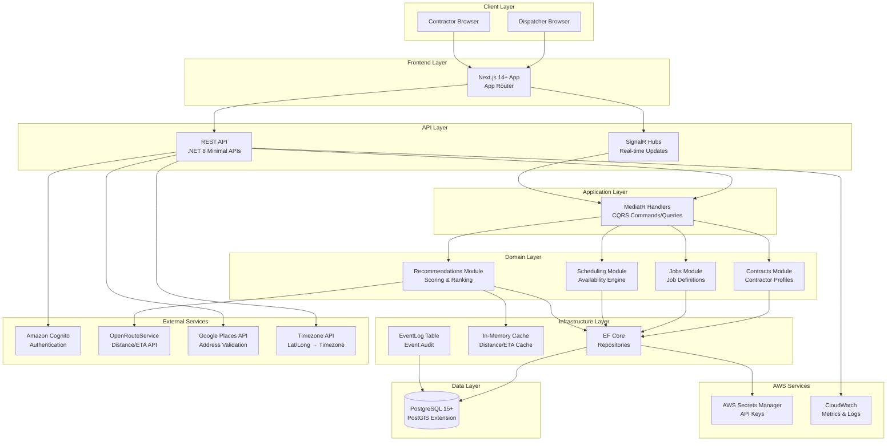

# High Level Architecture

### Technical Summary

SmartScheduler is built as a **Modular Monolith** using Domain-Driven Design (DDD) and CQRS patterns, deployed as a single .NET 8 application with strict internal boundaries. The frontend is a separate Next.js 14+ application using the App Router. The architecture separates concerns into **Domain**, **Application**, **Infrastructure**, and **API** layers, with a React/Next.js UI consuming REST APIs and SignalR hubs for real-time updates. The system integrates with AWS services (Cognito for authentication, PostgreSQL for persistence) and OpenRouteService for distance/ETA calculations. For MVP, the system uses in-memory caching and in-process event publishing to reduce deployment complexity. This architecture achieves PRD goals by enabling rapid development of the MVP while maintaining clear boundaries for future scaling, supporting the 500ms p95 latency requirement through in-memory caching and optimized distance calculation strategies, and providing real-time updates via SignalR for dispatcher and contractor workflows.

### Platform and Infrastructure Choice

**Platform:** AWS (Amazon Web Services)

**Key Services:**
- **Compute:** Elastic Beanstalk for .NET 8 application hosting (simplifies deployment with built-in auto-scaling, load balancing, and health monitoring)
- **Database:** RDS PostgreSQL 15+ with PostGIS extension for geospatial queries
- **Caching:** In-memory caching (IMemoryCache) for MVP - Redis can be added post-MVP if needed
- **Authentication:** Amazon Cognito (User Pool + Hosted UI) for OIDC/OAuth2
- **Storage:** S3 for static assets and file storage (if needed)
- **Monitoring:** CloudWatch for metrics and logs, X-Ray for distributed tracing
- **Secrets:** AWS Secrets Manager for API keys (OpenRouteService, Google Places API) and database credentials
- **Configuration:** SSM Parameter Store or AppConfig for versioned weights/config (post-MVP)

**Deployment Host and Regions:** 
- Primary region: us-east-1 (or user-specified)
- Single region deployment for MVP (multi-region is post-MVP per PRD)

**Rationale:**
- PRD explicitly specifies AWS as the cloud platform
- Elastic Beanstalk provides simplified deployment for .NET 8 applications with minimal infrastructure management overhead, ideal for MVP rapid development
- Elastic Beanstalk includes built-in auto-scaling, load balancing, health monitoring, and rolling deployments, reducing operational complexity
- SignalR WebSocket support requires session affinity (sticky sessions) on load balancer, which Elastic Beanstalk supports via Application Load Balancer configuration
- Cognito provides managed authentication with minimal setup overhead for MVP
- RDS PostgreSQL with PostGIS supports geospatial queries required for distance calculations
- In-memory caching (IMemoryCache) reduces deployment complexity for MVP while still enabling sub-500ms responses
- Redis can be added post-MVP if multi-instance deployment or persistent cache is needed
- AWS ecosystem integration simplifies deployment and operations
- Cost-effective for MVP scale while providing clear scaling path (Elastic Beanstalk uses underlying EC2 instances, no additional service fee)

### Repository Structure

**Structure:** Monorepo (single repository for backend and frontend)

**Monorepo Tool:** N/A - Simple folder structure (no additional tooling for MVP)

**Package Organization:**
```
smart-scheduler/
├── src/              # Backend (.NET 8)
│   ├── Api/
│   ├── Application/
│   ├── Domain/
│   ├── Infrastructure/
│   └── Realtime/     # SignalR hubs
├── ui/
│   └── web/          # Next.js 14+ frontend
└── docs/              # Documentation (PRD, Architecture, etc.)
```

**Rationale:**
- PRD specifies this folder layout in section "Folder Layout (repo)"
- Simple structure sufficient for MVP (no need for complex monorepo tooling)
- Clear separation between backend (`src/`) and frontend (`ui/web/`)
- Shared code can be added later if needed (e.g., TypeScript types for API contracts)

### High Level Architecture Diagram



### Architectural Patterns

- **Modular Monolith:** Single deployable application with strict internal module boundaries - _Rationale:_ Enables rapid MVP development while maintaining clear separation for future microservices extraction if needed. PRD explicitly specifies this pattern.

- **Domain-Driven Design (DDD):** Domain entities, value objects, aggregates, and domain events - _Rationale:_ Ensures business logic is properly encapsulated in domain models, making the system more maintainable and aligned with business requirements. PRD specifies DDD as core architecture principle.

- **CQRS (Command Query Responsibility Segregation):** Separate command and query handlers using MediatR - _Rationale:_ Enables optimized read/write paths, supports event sourcing patterns for audit trails, and simplifies complex business logic. PRD specifies CQRS as part of the architecture.

- **Clean Architecture Layers:** Domain, Application, Infrastructure, API layers with dependency inversion - _Rationale:_ Ensures business logic is independent of infrastructure concerns, enabling testability and future technology swaps. PRD specifies Clean Architecture layers.

- **Event-Driven Architecture:** Domain events published in-process with SignalR - _Rationale:_ Enables real-time UI updates via SignalR, supports future integrations (BI, notifications), and maintains loose coupling between modules. Project Brief requires event publishing (JobAssigned, ScheduleUpdated, ContractorRated) but allows simulating a message bus. For MVP, in-process publishing with EventLog table for audit is sufficient.

- **Repository Pattern:** Abstract data access through repositories in Infrastructure layer - _Rationale:_ Enables testing with in-memory implementations, provides flexibility for future database changes, and maintains clean separation between domain and persistence.

- **In-Process Event Publishing:** Events published synchronously in-process with SignalR, logged to EventLog table - _Rationale:_ Simplifies MVP deployment by avoiding background workers and message bus infrastructure. Events are published immediately to SignalR for real-time UI updates, and logged to EventLog table for audit trail. Background worker and Outbox pattern can be added post-MVP if needed for external integrations.

- **Coarse-to-Refine Strategy:** Haversine distance for initial filtering, OpenRouteService for top candidates - _Rationale:_ Optimizes for sub-500ms latency by reducing expensive API calls, uses cheap Haversine for bulk filtering, and refines only top 5-8 candidates. PRD explicitly specifies this strategy.

